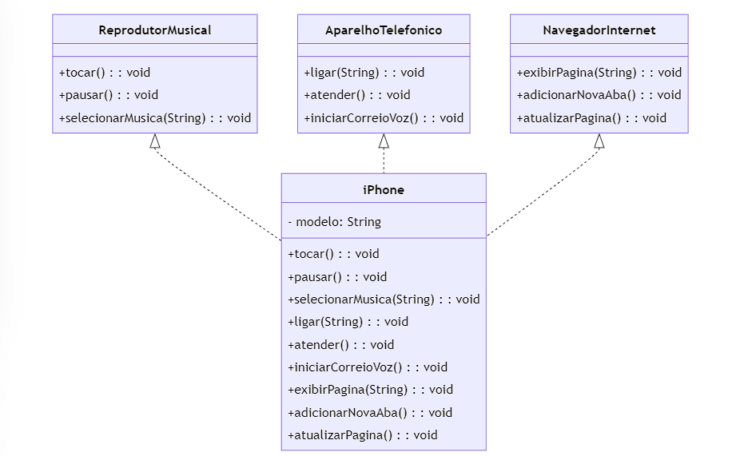

# Diagrama UML das Funcionalidades do iPhone

Este repositório contém o diagrama UML e a implementação em Java para modelar as principais funcionalidades do iPhone original, conforme apresentado no evento de lançamento de 2007. As funcionalidades modeladas incluem um Reprodutor Musical, um Aparelho Telefônico e um Navegador na Internet.

## Diagrama UML

O diagrama UML abaixo representa a estrutura das funcionalidades do iPhone:

## Visão Geral do Diagrama

O iPhone é modelado usando os seguintes componentes:

### Interface ReprodutorMusical

Representa a funcionalidade de reprodutor musical.

- `tocar()`: Reproduz uma música.
- `pausar()`: Pausa a música atual.
- `selecionarMusica(String musica)`: Seleciona uma música específica para tocar.

### Interface AparelhoTelefonico

Representa a funcionalidade de telefone.

- `ligar(String numero)`: Faz uma chamada para o número especificado.
- `atender()`: Atende uma chamada recebida.
- `iniciarCorreioVoz()`: Inicia o serviço de correio de voz.

### Interface NavegadorInternet

Representa a funcionalidade de navegação na internet.

- `exibirPagina(String url)`: Exibe a página da web especificada.
- `adicionarNovaAba()`: Adiciona uma nova aba no navegador.
- `atualizarPagina()`: Atualiza a página da web atual.

### Classe iPhone

Implementa as três interfaces, fornecendo implementações concretas para cada método.

